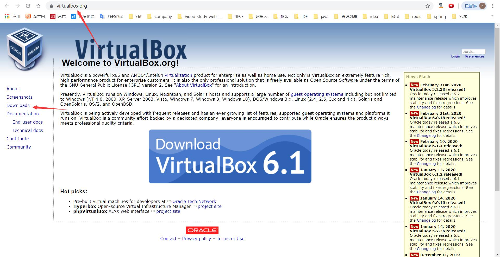

# docker学习笔记-docker安装

## 安装virtualbox

1. 访问**[virtualbox官网](https://www.virtualbox.org/)**的**[下载链接](https://www.virtualbox.org/wiki/Downloads)**

   

2. 点击Windows hosts下载windows版本的virtualbox

   

3. 下载后直接下一步, 下一步安装即可

## 安装Vagrant

1. 访问**[Vagrant官网](https://www.vagrantup.com/)**的**[下载链接](https://www.vagrantup.com/downloads.html)**

   

   

   

   

2. 选择windows-64bit版本, 复制下载链接, 使用迅雷下载

3. 下载后直接下一步, 下一步安装即可

4. 打开CMD, 输入vagrant --version, 能够看到版本信息表示Vagrant安装成功

## 使用Vagrant
1. 先启动virtualbox

2. 下载Vagrant要使用的box文件, 如:**CentOS-7-x86_64-Vagrant-1804_02.VirtualBox.box**

   进入[**Vagrant官网**](https://www.vagrantup.com/)点击[**Find boxes**](https://app.vagrantup.com/boxes/search)

   

   选择CentOS, 点击进入


​	获取url, 可以直接右键复制链接, 也可以点进去, 在地址栏复制链接


​	拼接最终的url, 得到下载链接

'https://app.vagrantup.com/centos/boxes/7/versions/2020.01'+'/providers/'+'供应商名字/'+'.box'

​	最终得到url(该方式可能会变)

https://app.vagrantup.com/centos/boxes/7/versions/2020.01/providers/virtualbox.box

3. 将下载的box文件放在某个目录, 如**H:\operate-system\CentOS-7-x86_64-Vagrant-1804_02.VirtualBox.box**

4. 添加box

   打开CMD, 先创建一个空目录, 如:F:\data\vagrant\centos7, 再添加box

   ```shell
   mkdir -p vagrant\centos7
   cd vagrant\centos7
   vagrant box add centos7 H:\operate-system\CentOS-7-x86_64-Vagrant-1804_02.VirtualBox.box	#这条命令相当于是向vagrant添加了一块硬盘
   ```

5. 初始化虚拟机

   ```shell
   vagrant init
   ```

6. 如果前面的命令都执行成功, 此时会在virtualbox中看到新创建了一个虚拟机, 此时centos虚拟机创建成功

7. 启动虚拟机

   ```shell
   vagrant up
   ```

   

8. vagrant常用命令

   | 命令                            | 含义             |
   | ------------------------------- | ---------------- |
   | vagrant init                    | 初始化虚拟机     |
   | vagrant up                      | 启动虚拟机(开机) |
   | vagrant halt                    | 关闭虚拟机(关机) |
   | vagrant reload                  | 重启虚拟机       |
   | vagrant ssh                     | 进入虚拟机       |
   | exit                            | 退出虚拟机       |
   | vagrant suspend                 | 挂起虚拟机       |
   | vagrant resume                  | 唤醒虚拟机       |
   | vagrant destroy                 | 删除虚拟机       |
   | vagrant box list                | 查看本地box列表  |
   | vagrant box add boxname box文件 | 添加box至本地    |
   | vagrant box remove              | 删除box          |

   

## 在虚拟机中安装docker

1. 进入虚拟机

   ```shell
   vagrant ssh
   ```

2. 删除系统中原有的旧版本docker

   ```shell
   sudo yum remove docker \
                     docker-client \
                     docker-client-latest \
                     docker-common \
                     docker-latest \
                     docker-latest-logrotate \
                     docker-logrotate \
                     docker-engine
   ```

3. 安装必须的packages

   ```shell
   sudo yum install -y yum-utils \
     device-mapper-persistent-data \
     lvm2
   ```

4. 设置yum源, 需要使用国内镜像, 否则后面会报404

   ```shell
   ls /etc/yum.repos.d	#添加yum源之前可以先查看本机已有的yum源
   yum-config-manager --add-repo http://mirrors.aliyun.com/docker-ce/linux/centos/docker-ce.repo
   /etc/yum.repos.d	#查看刚刚新增的yum源
   ```

5. 安装docker

   ```shell
   sudo yum install docker-ce docker-ce-cli containerd.io
   ```

6. 启动docker

   ```shell
   sudo systemctl start docker
   ```

7. 验证docker是否安装成功

   ```shell
   sudo docker run hello-world
   ```

   
